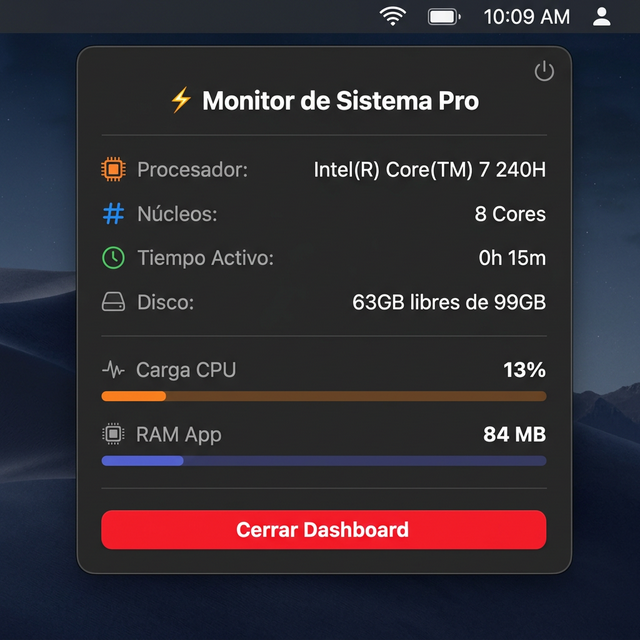

<div align="center">

# ⚡ MonitorPro

**Monitor de sistema en tiempo real para macOS · Real-time macOS system monitor**

[](https://swift.org)
[](https://www.apple.com/macos)
[](https://developer.apple.com/xcode/swiftui/)
[](LICENSE)

</div>

---

## 🌐 Idiomas · Languages

- 🇪🇸 [Español](#-español)
- 🇬🇧 [English](#-english)

---

# 🇪🇸 Español

## 📋 Índice

1. [¿Qué es MonitorPro?](#-qué-es-monitorpro)
2. [Capturas de pantalla](#-capturas-de-pantalla)
3. [Características](#-características)
4. [Requisitos](#-requisitos)
5. [Instalación](#-instalación)
6. [Uso](#-uso)
7. [Arquitectura del proyecto](#-arquitectura-del-proyecto)
8. [Tecnologías utilizadas](#-tecnologías-utilizadas)
9. [Contribuir](#-contribuir)
10. [Licencia](#-licencia)

---

## 🚀 ¿Qué es MonitorPro?

**MonitorPro** es una aplicación nativa de **barra de menú para macOS** que te permite monitorear los recursos de tu Mac en tiempo real, directamente desde la barra superior del sistema. Sin ventanas flotantes, sin distracciones — siempre a un clic de distancia.

> 💡 Diseñado para ser **ligero**, **discreto** y **siempre visible** en tu flujo de trabajo diario.

---

## 📸 Capturas de pantalla

<div align="center">



*Dashboard desplegable de MonitorPro en acción*

</div>

---

## ✨ Características

| Métrica            | Descripción                                              | Actualización |
|--------------------|----------------------------------------------------------|---------------|
| 🟠 **CPU**        | Nombre y modelo del procesador                           | Al inicio     |
| 🔵 **Núcleos**    | Número de núcleos activos                                | Al inicio     |
| 🟢 **Uptime**     | Tiempo de actividad del sistema                          | Cada segundo  |
| ⚫ **Disco**      | Espacio libre y total en GB                              | Cada segundo  |
| 📊 **Carga CPU**  | Uso real por diferencial de ticks (user+sys vs idle)     | Cada segundo  |
| 💾 **RAM App**    | Memoria RAM usada por la app                             | Cada segundo  |

- ✅ Vive en la **barra de menú** — no ocupa espacio en el Dock
- ✅ Interfaz **nativa SwiftUI** — fluida y eficiente
- ✅ Actualizaciones en **tiempo real** (cada 1 segundo)
- ✅ Carga de CPU **medida con precisión real** por núcleo (diferencial de ticks)
- ✅ Botón para **cerrar** la app desde el propio dashboard
- ✅ **0 dependencias externas** — usa únicamente frameworks de Apple

---

## 🛠 Requisitos

- **macOS** 13 Ventura o superior
- **Xcode** 15 o superior
- **Swift** 5.9 o superior
- Mac con arquitectura Apple Silicon o Intel

---

## 📦 Instalación

### Desde el código fuente

1. **Clona el repositorio:**
   ```bash
   git clone https://github.com/alberto2005-coder/MonitorPro.git
   cd MonitorPro
   ```

2. **Abre el proyecto en Xcode:**
   ```bash
   open MonitorPro.xcodeproj
   ```

3. **Selecciona tu Mac como destino** en la barra de Xcode.

4. **Compila y ejecuta** con `⌘ + R`.

> ⚠️ Es posible que necesites configurar tu **Team de desarrollo** en *Signing & Capabilities* con tu Apple ID.

---

## 📖 Uso

1. Al ejecutar la app, aparece un icono **⊙** en tu barra de menú superior.
2. Haz **clic** en el icono para abrir el dashboard.
3. Visualiza en tiempo real el estado de tu sistema.
4. Haz clic en **"Cerrar Dashboard"** para terminar la app.

---

## 🗂 Arquitectura del proyecto

```
MonitorPro/
├── MonitorPro/
│   ├── MonitorProApp.swift      # Punto de entrada — MenuBarExtra
│   ├── ContentView.swift        # UI principal del dashboard
│   ├── MonitorPro.entitlements  # Permisos de la app
│   └── Assets.xcassets/         # Recursos (iconos, colores)
├── SystemMonitor.swift          # Lógica de monitoreo del sistema
├── MonitorProTests/             # Tests unitarios
├── MonitorProUITests/           # Tests de interfaz
├── MonitorPro.xcodeproj/        # Configuración del proyecto Xcode
├── .gitignore
├── .gitattributes
└── README.md
```

### Flujo de datos

```
SystemMonitor (ObservableObject)
    │
    ├── init() ──► getCPUName()  (una sola vez)
    │
    ├── Timer cada 1s ──► getMemoryUsage()   → usageMB
    │                ──► updateDiskSpace()   → diskFreeGB, diskTotalGB
    │                ──► getUptime()         → uptime
    │                ──► updateCPULoad()     → cpuLoad (ticks reales)
    │
    ├── deinit ──► timer.invalidate()  (limpieza de memoria)
    │
    └── @Published vars ──► ContentView (SwiftUI) ──► UI actualizada
```

---

## 🧰 Tecnologías utilizadas

| Tecnología             | Uso                                          |
|------------------------|----------------------------------------------|
| **SwiftUI**            | Framework de interfaz de usuario             |
| **Foundation**         | Manejo de procesos y sistema                 |
| **MenuBarExtra**       | Integración en barra de menú                 |
| **mach / sysctlbyname**| Lectura de métricas del sistema a bajo nivel |
| **FileManager**        | Consulta del espacio en disco                |

---

## 🤝 Contribuir

¡Las contribuciones son bienvenidas! Si quieres mejorar MonitorPro:

1. Haz un **fork** del repositorio
2. Crea una rama: `git checkout -b feature/nueva-funcionalidad`
3. Haz tus cambios y commitea: `git commit -m "feat: añadir nueva funcionalidad"`
4. Haz **push**: `git push origin feature/nueva-funcionalidad`
5. Abre un **Pull Request**

---

## 📄 Licencia

Este proyecto está bajo la licencia **MIT**. Consulta el archivo [LICENSE](LICENSE) para más detalles.

---

<div align="center">
Hecho con ❤️ y Swift en macOS
</div>

---
---

# 🇬🇧 English

## 📋 Table of Contents

1. [What is MonitorPro?](#-what-is-monitorpro)
2. [Screenshots](#-screenshots)
3. [Features](#-features)
4. [Requirements](#-requirements)
5. [Installation](#-installation)
6. [Usage](#-usage)
7. [Project Architecture](#-project-architecture)
8. [Technologies Used](#-technologies-used)
9. [Contributing](#-contributing)
10. [License](#-license)

---

## 🚀 What is MonitorPro?

**MonitorPro** is a native **macOS menu bar application** that lets you monitor your Mac's resources in real time, directly from the system's top bar. No floating windows, no distractions — always one click away.

> 💡 Designed to be **lightweight**, **unobtrusive**, and **always visible** in your daily workflow.

---

## 📸 Screenshots

<div align="center">


*MonitorPro dropdown dashboard in action*

</div>

---

## ✨ Features

| Metric             | Description                                              | Refresh Rate |
|--------------------|----------------------------------------------------------|--------------|
| 🟠 **CPU**         | Processor name and model                                 | On start     |
| 🔵 **Cores**       | Number of active processor cores                         | On start     |
| 🟢 **Uptime**      | System uptime                                            | Every second |
| ⚫ **Disk**        | Free and total disk space in GB                          | Every second |
| 📊 **CPU Load**    | Real usage via tick differential (user+sys vs idle)      | Every second |
| 💾 **App RAM**     | RAM memory used by the app                               | Every second |

- ✅ Lives in the **menu bar** — no Dock icon
- ✅ Native **SwiftUI** interface — smooth and efficient
- ✅ **Real-time** updates (every 1 second)
- ✅ CPU load measured with **real per-core tick differential**
- ✅ **Close** button built into the dashboard
- ✅ **Zero external dependencies** — uses only Apple frameworks

---

## 🛠 Requirements

- **macOS** 13 Ventura or later
- **Xcode** 15 or later
- **Swift** 5.9 or later
- Mac with Apple Silicon or Intel architecture

---

## 📦 Installation

### From source code

1. **Clone the repository:**
   ```bash
   git clone https://github.com/alberto2005-coder/MonitorPro.git
   cd MonitorPro
   ```

2. **Open the project in Xcode:**
   ```bash
   open MonitorPro.xcodeproj
   ```

3. **Select your Mac as the target** in Xcode's toolbar.

4. **Build and run** with `⌘ + R`.

> ⚠️ You may need to configure your **development Team** in *Signing & Capabilities* with your Apple ID.

---

## 📖 Usage

1. When you launch the app, a **⊙** icon appears in your top menu bar.
2. **Click** the icon to open the dashboard.
3. View your system's stats in real time.
4. Click **"Close Dashboard"** to quit the app.

---

## 🗂 Project Architecture

```
MonitorPro/
├── MonitorPro/
│   ├── MonitorProApp.swift      # Entry point — MenuBarExtra
│   ├── ContentView.swift        # Main dashboard UI
│   ├── MonitorPro.entitlements  # App permissions
│   └── Assets.xcassets/         # Resources (icons, colors)
├── SystemMonitor.swift          # System monitoring logic
├── MonitorProTests/             # Unit tests
├── MonitorProUITests/           # UI tests
├── MonitorPro.xcodeproj/        # Xcode project configuration
├── .gitignore
├── .gitattributes
└── README.md
```

### Data Flow

```
SystemMonitor (ObservableObject)
    │
    ├── init() ──► getCPUName()  (once)
    │
    ├── Timer every 1s ──► getMemoryUsage()   → usageMB
    │                 ──► updateDiskSpace()   → diskFreeGB, diskTotalGB
    │                 ──► getUptime()         → uptime
    │                 ──► updateCPULoad()     → cpuLoad (real ticks)
    │
    ├── deinit ──► timer.invalidate()  (memory cleanup)
    │
    └── @Published vars ──► ContentView (SwiftUI) ──► Updated UI
```

---

## 🧰 Technologies Used

| Technology              | Usage                                          |
|-------------------------|------------------------------------------------|
| **SwiftUI**             | User interface framework                       |
| **Foundation**          | Process and system management                  |
| **MenuBarExtra**        | Menu bar integration                           |
| **mach / sysctlbyname** | Low-level system metrics reading               |
| **FileManager**         | Disk space queries                             |

---

## 🤝 Contributing

Contributions are welcome! To improve MonitorPro:

1. **Fork** the repository
2. Create a branch: `git checkout -b feature/new-feature`
3. Make your changes and commit: `git commit -m "feat: add new feature"`
4. **Push**: `git push origin feature/new-feature`
5. Open a **Pull Request**

---

## 📄 License

This project is licensed under the **MIT License**. See the [LICENSE](LICENSE) file for details.

---

<div align="center">
Made with ❤️ and Swift on macOS
</div>
